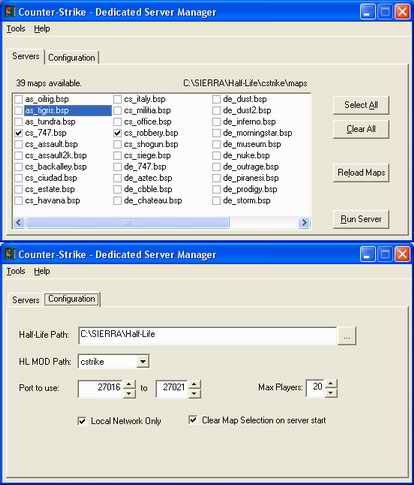



## Counter\-Strike Dedicated Server Manager

### Description

With this code U can create dedicated half-life/counter-strike server in your system. Possibility to create more than 1 server. (up to 5) Getting the game path (half-life) from registry automatically. Also getting all maps installed in your system.
 
### More Info
 
You should have installed half-life/MOD version of counter-strike.

             |
---                |---
**Submitted On**   |2003-03-13 02:11:00
**By**             |[Abdul Rasheed](https://github.com/Planet-Source-Code/PSCIndex/blob/master/ByAuthor/abdul-rasheed.md)
**Level**          |Beginner
**User Rating**    |5.0 (15 globes from 3 users)
**Compatibility**  |VB 4\.0 \(32\-bit\), VB 5\.0, VB 6\.0
**Category**       |[Miscellaneous](https://github.com/Planet-Source-Code/PSCIndex/blob/master/ByCategory/miscellaneous__1-1.md)
**World**          |[Visual Basic](https://github.com/Planet-Source-Code/PSCIndex/blob/master/ByWorld/visual-basic.md)
**Archive File**   |[Counter\-St1563763242003\.zip](https://github.com/Planet-Source-Code/abdul-rasheed-counter-strike-dedicated-server-manager__1-44215/archive/master.zip)

